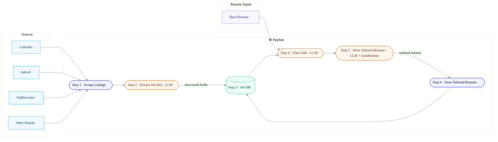

# Job Apply Assistant Bot

An automated job application system that scrapes jobs, enriches them with external data, and generates tailored application materials.

## Monorepo Layout
- `jobspy/` – core scraping library originally shipped with this repository
- `backend/` – new FastAPI service that orchestrates scraping, enrichment, and workflow automation
- `backend/cli/` – Typer + Rich command-line tools for scraping jobs and enriching company data
- `frontend/` – planned Next.js dashboard (coming soon)
- `notebooks/` – Jupyter explorations such as Proxycurl integration prototypes
- `scrape_jobs.py` – legacy helper script that exercises the jobspy library

## Quick Start
- Backend API: see `backend/README.md` for PDM setup, `.env` configuration, and local server instructions
- CLI scraping: `cd backend && pdm run jobbot scrape --search-term "software engineer" --location "San Francisco" --results-wanted 10`
- Frontend: placeholder until the Next.js app lands in later phases
- JobSpy tooling: continue using `requirements.txt` or Poetry config from the repo root

## Architecture

This system consists of three cooperating layers: job scraping (JobSpy), backend APIs (FastAPI + PostgreSQL), and a forthcoming frontend for human review. Data flows from external job boards into our database, enriched with Proxycurl where needed, before reaching the UI.



## JobSpy Library & Legacy Script

The `scrape_jobs.py` script scrapes job postings from LinkedIn using the [JobSpy library](https://github.com/speedyapply/JobSpy).

**Run the scraper:**

```bash
python scrape_jobs.py
```

**Configuration:**

The script ships with these defaults:
- **Search Term:** "software engineer"
- **Location:** "San Francisco, CA"
- **Number of Results:** 50 jobs
- **Output File:** `jobs.csv`

Update the variables in `scrape_jobs.py` to customize:

```python
search_term = "your job title"
location = "your location"
results_wanted = 50
```

**Output:**

`jobs.csv` will contain job metadata such as titles, employers, locations, salary hints, descriptions, and URLs.

**Important Notes:**
- LinkedIn can rate-limit repeated scrapes. Add delays or proxies as needed.
- The script sets `linkedin_fetch_description=True`, increasing the number of LinkedIn requests.

## Resources

- [JSON Resume](https://docs.jsonresume.org/)

## Backend

### CLI Tools
The backend ships with a Typer-powered CLI (`pdm run jobbot`) that scrapes LinkedIn via JobSpy, enriches companies using Proxycurl, and writes everything to PostgreSQL with Rich-powered progress bars. See [backend/README.md](backend/README.md#cli-tools) for full usage instructions.

Key features:
- Scrapes jobs using the `python-jobspy` library
- Enriches LinkedIn companies through the Proxycurl API
- Deduplicates companies by LinkedIn URL and jobs by `job_url`
- Presents colorful status updates, progress bars, and a summary table in the terminal
