# Job Apply Assistant Bot

An automated job application system that scrapes jobs, enriches them with external data, and generates tailored application materials.

## Monorepo Layout
- `jobspy/` – core scraping library originally shipped with this repository
- `backend/` – new FastAPI service that orchestrates scraping, enrichment, and workflow automation
- `backend/cli/` – Typer + Rich command-line tools for scraping jobs and enriching company data
- `frontend/` – Next.js 14 frontend (TypeScript + Tailwind + shadcn/ui) for reviewing curated jobs
- `notebooks/` – Jupyter explorations such as Proxycurl integration prototypes
- `scrape_jobs.py` – legacy helper script that exercises the jobspy library

## Quick Start
1. **Start PostgreSQL**
   ```bash
   docker-compose up -d
   ```
2. **Set up and start the backend**
   ```bash
   cd backend
   pdm install
   alembic upgrade head
   pdm run uvicorn app.main:app --reload
   ```
   Backend runs on http://localhost:8000
3. **Populate the database (first run)**
   ```bash
   cd backend
   pdm run jobbot scrape --search-term "software engineer" --location "San Francisco" --results-wanted 20
   ```
4. **Set up and start the frontend**
   ```bash
   cd frontend
   npm install
   cp .env.example .env.local
   npm run dev
   ```
   Frontend runs on http://localhost:3000

## Frontend
- Next.js 14 application for browsing job opportunities with a clean responsive interface
- Uses Tailwind CSS and shadcn/ui for a lightweight, composable design system
- Jobs table supports job type badges, location/compensation display, and relative "posted" timestamps
- ✅ Job detail pages with company profiles, action buttons, custom 404 UX, and metadata-driven SEO
- ✅ REST integration with the FastAPI backend plus loading/error boundaries on listing and detail routes
- See [frontend/README.md](frontend/README.md) for setup notes, scripts, and structure

## Architecture

Three-tier architecture:
- **Frontend:** Next.js 14 (React) on http://localhost:3000  
  Server Components fetch data from the backend while Client Components (like the jobs table) hydrate with the results.
- **Backend:** FastAPI on http://localhost:8000  
  Exposes REST endpoints, manages SQLAlchemy models, and orchestrates scraping/enrichment workflows.
- **Database:** PostgreSQL (Docker) on port 5432  
  Stores jobs, companies, and enrichment metadata managed via Alembic migrations.

Communication:
- Frontend → Backend: REST (JSON) via `lib/api.ts`
- Backend → Database: SQLAlchemy ORM sessions
- Backend → External APIs: JobSpy for scraping, Proxycurl for company enrichment

Data flows from the frontend into the API, which orchestrates scraping/enrichment before persisting to PostgreSQL.

```mermaid
%%{init: {
  "theme": "base",
  "themeVariables": {
    "primaryColor": "#EEF2FF",
    "primaryTextColor": "#111827",
    "primaryBorderColor": "#6366F1",
    "lineColor": "#94A3B8",
    "fontSize": "14px",
    "fontFamily": "Inter, ui-sans-serif, system-ui"
  }
}}%%
flowchart LR
  %% LAYOUT
  %% Sources on left -> ETL/LLM center -> DB right
  %% ----------------------------------------------------------------
  subgraph S[🔎 Sources]
    direction TB
    A[LinkedIn]:::source
    B[Indeed]:::source
    C[ZipRecruiter]:::source
    D[Other Boards]:::source
  end

  subgraph P[⚙️ Pipeline]
    direction LR
    E([Step 1 · Scrape Listings]):::step
    F([Step 2 · Extract Job Info · LLM]):::llm
    G[(Step 3 · Job DB)]:::db
    H([Step 4 · Filter Jobs · LLM]):::llm
    J([Step 5 · Write Tailored Resume · LLM + JsonResume]):::llm
    K([Step 6 · Store Tailored Resume]):::step
  end

  subgraph R[🧰 Resume Inputs]
    direction TB
    I[Base Resume]:::input
  end

  %% FLOWS
  A --> E
  B --> E
  C --> E
  D --> E

  E --> F
  F -->|structured fields| G

  G --> H
  I --> H
  H --> J
  J -->|tailored resume| K
  K --> G

  %% STYLES
  classDef source fill:#F0F9FF,stroke:#38BDF8,stroke-width:1px,color:#0C4A6E;
  classDef step fill:#EEF2FF,stroke:#6366F1,stroke-width:1px,color:#111827;
  classDef llm fill:#FFF7ED,stroke:#FB923C,stroke-width:1px,color:#7C2D12;
  classDef db fill:#ECFDF5,stroke:#34D399,stroke-width:1px,color:#064E3B;
  classDef input fill:#FAF5FF,stroke:#A78BFA,stroke-width:1px,color:#3730A3;
```



## JobSpy Library & Legacy Script

The `scrape_jobs.py` script scrapes job postings from LinkedIn using the [JobSpy library](https://github.com/speedyapply/JobSpy).

**Run the scraper:**

```bash
python scrape_jobs.py
```

**Configuration:**

The script ships with these defaults:
- **Search Term:** "software engineer"
- **Location:** "San Francisco, CA"
- **Number of Results:** 50 jobs
- **Output File:** `jobs.csv`

Update the variables in `scrape_jobs.py` to customize:

```python
search_term = "your job title"
location = "your location"
results_wanted = 50
```

**Output:**

`jobs.csv` will contain job metadata such as titles, employers, locations, salary hints, descriptions, and URLs.

**Important Notes:**
- LinkedIn can rate-limit repeated scrapes. Add delays or proxies as needed.
- The script sets `linkedin_fetch_description=True`, increasing the number of LinkedIn requests.

## Resources

- [JSON Resume](https://docs.jsonresume.org/)

## Backend

### CLI Tools
The backend ships with a Typer-powered CLI (`pdm run jobbot`) that scrapes LinkedIn via JobSpy, enriches companies using Proxycurl, and writes everything to PostgreSQL with Rich-powered progress bars. See [backend/README.md](backend/README.md#cli-tools) for full usage instructions.

Key features:
- Scrapes jobs using the `python-jobspy` library
- Enriches LinkedIn companies through the Proxycurl API
- Deduplicates companies by LinkedIn URL and jobs by `job_url`
- Presents colorful status updates, progress bars, and a summary table in the terminal

## Development Workflow
Recommended layout for local hacking:

1. **Terminal 1 – Database**
   ```bash
   docker-compose up
   ```
2. **Terminal 2 – Backend**
   ```bash
   cd backend
   pdm run uvicorn app.main:app --reload
   ```
3. **Terminal 3 – Frontend**
   ```bash
   cd frontend
   npm run dev
   ```

Access points:
- Frontend UI: http://localhost:3000
- Backend API: http://localhost:8000
- API Docs: http://localhost:8000/docs
- PostgreSQL: `localhost:5432` (`postgres` / `postgres`, database `jobbot`)

With all services running, browse http://localhost:3000 to view the jobs listing hydrated from the API, open `/jobs/[id]` for details + company info, and navigate to `/jobs/999` to see the custom 404 page.

## Project Status

**Completed**
- Backend setup (FastAPI, PostgreSQL, Alembic)
- Database models (Job, Company)
- CLI scraping tool (JobSpy + Proxycurl enrichment)
- Frontend setup (Next.js, TypeScript, Tailwind)
- Jobs listing page
- Job detail page with company profile
- REST API endpoints for listing + detail
- API integration with loading and error states

**Next steps**
- LLM integration for resume generation
- Job filtering and search
- User authentication
- Save/bookmark jobs
- Application tracking
