# AI Job Bot

An automated job application system that scrapes jobs, filters them using AI, and generates tailored resumes.


## Architecture

```mermaid
%%{init: {
  "theme": "base",
  "themeVariables": {
    "primaryColor": "#EEF2FF",
    "primaryTextColor": "#111827",
    "primaryBorderColor": "#6366F1",
    "lineColor": "#94A3B8",
    "fontSize": "14px",
    "fontFamily": "Inter, ui-sans-serif, system-ui"
  }
}}%%
flowchart LR
  %% LAYOUT
  %% Sources on left -> ETL/LLM center -> DB right
  %% ----------------------------------------------------------------
  subgraph S[🔎 Sources]
    direction TB
    A[LinkedIn]:::source
    B[Indeed]:::source
    C[ZipRecruiter]:::source
    D[Other Boards]:::source
  end

  subgraph P[⚙️ Pipeline]
    direction LR
    E([Step 1 · Scrape Listings]):::step
    F([Step 2 · Extract Job Info · LLM]):::llm
    G[(Step 3 · Job DB)]:::db
    H([Step 4 · Filter Jobs · LLM]):::llm
    J([Step 5 · Write Tailored Resume · LLM + JsonResume]):::llm
    K([Step 6 · Store Tailored Resume]):::step
  end

  subgraph R[🧰 Resume Inputs]
    direction TB
    I[Base Resume]:::input
  end

  %% FLOWS
  A --> E
  B --> E
  C --> E
  D --> E

  E --> F
  F -->|structured fields| G

  G --> H
  I --> H
  H --> J
  J -->|tailored resume| K
  K --> G

  %% STYLES
  classDef source fill:#F0F9FF,stroke:#38BDF8,stroke-width:1px,color:#0C4A6E;
  classDef step fill:#EEF2FF,stroke:#6366F1,stroke-width:1px,color:#111827;
  classDef llm fill:#FFF7ED,stroke:#FB923C,stroke-width:1px,color:#7C2D12;
  classDef db fill:#ECFDF5,stroke:#34D399,stroke-width:1px,color:#064E3B;
  classDef input fill:#FAF5FF,stroke:#A78BFA,stroke-width:1px,color:#3730A3;
```



## Resources 

- [JSON Resume](https://docs.jsonresume.org/)

## Getting Started

### Prerequisites

- Python 3.10 or higher
- pip (Python package installer)

### Installation

1. Clone this repository
2. Install the required dependencies:

```bash
pip install -r requirements.txt
```

### Usage

#### LinkedIn Job Scraper

The `scrape_jobs.py` script scrapes job postings from LinkedIn using the [JobSpy library](https://github.com/speedyapply/JobSpy).

**Run the scraper:**

```bash
python scrape_jobs.py
```

**Configuration:**

The script is configured with the following default parameters:
- **Search Term:** "software engineer"
- **Location:** "San Francisco, CA"
- **Number of Results:** 50 jobs
- **Output File:** `jobs.csv`

To customize these parameters, edit the variables in `scrape_jobs.py`:

```python
search_term = "your job title"
location = "your location"
results_wanted = 50
```

**Output:**

The script will create a `jobs.csv` file containing:
- Job title
- Company name
- Location
- Job type (full-time, part-time, etc.)
- Salary information (if available)
- Job description
- Job URL
- And more...

**Important Notes:**
- LinkedIn may rate-limit requests after multiple scrapes. If you encounter issues, consider using proxies or waiting between scrapes.
- The script uses `linkedin_fetch_description=True` to get full job details, which increases the number of requests.

